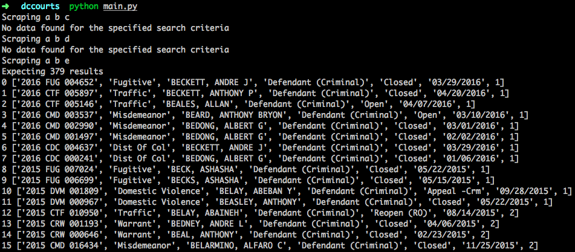

# DCCourts Scraper

Scrape [DCCourts](https://www.dccourts.gov/cco/maincase.jsf). WIP.



## Usage
```
python main.py
```

## Setup

Tested with Python 3.5.1 and 2.7.11. Python 3.5.1 from the Anaconda distribution is preferred.

**With Anaconda**

```
conda create -n dccourts requests lxml cssselect
source activate dccourts
pip install blessings
```

**With Pip**

```
pip install -r requirements.txt
```

or

```
pip install requests lxml cssselect blessings
```